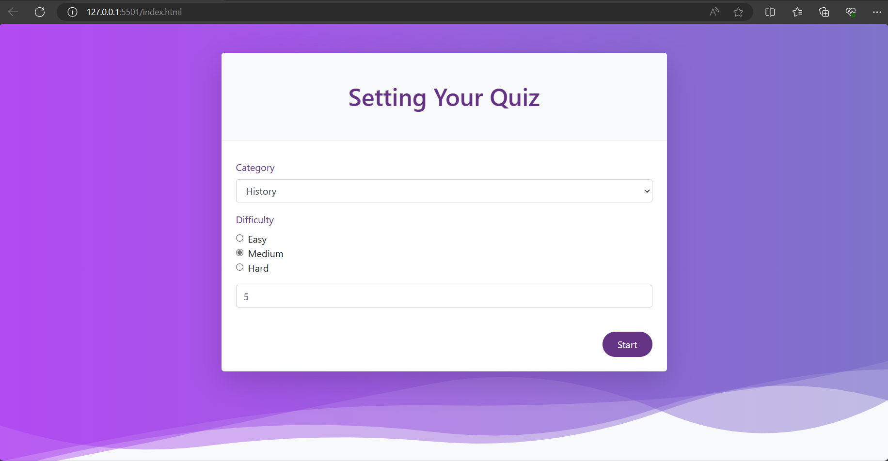
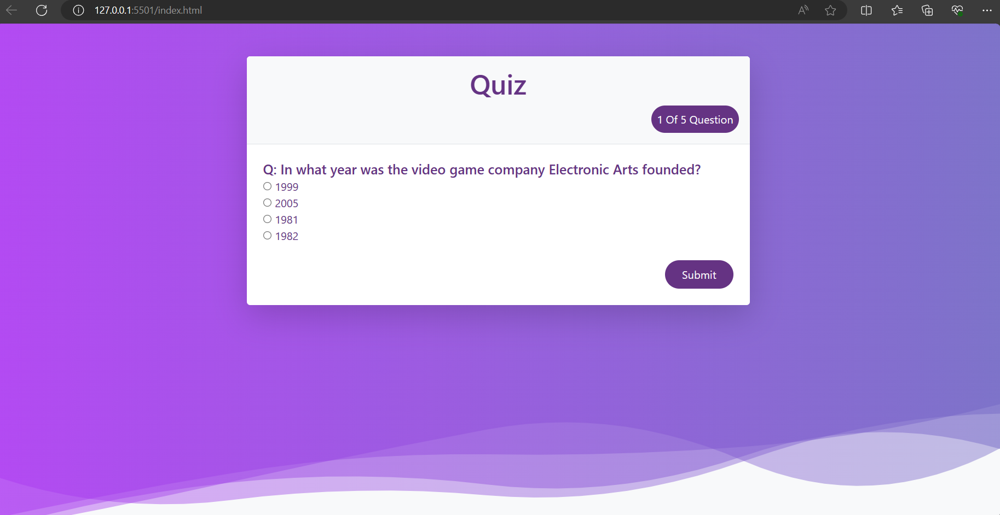

# Test-Your-Knowledge

## Description
Test Your Knowledge is a web application designed to offer users the opportunity to take quizzes in multiple subjects. The application is built using HTML, CSS, and JavaScript with an object-oriented programming (OOP) approach in JavaScript.

## Features
- Multiple-choice questions in various subjects like history, sports, etc.
- Random selection of questions for each quiz attempt.
- Score tracking and display at the end of each quiz.
- Responsive design for seamless usage across different devices.

## Technologies Used
- HTML
- CSS
- JavaScript (with OOP principles)

## Getting Started
To run the application locally, follow these steps:

1. Clone this repository to your local machine.
2. Open the project directory.
3. Open `index.html` in your preferred web browser.

## Usage
1. Upon opening the application, select the subject of the quiz you want to take.
2. Start the quiz and answer the multiple-choice questions provided.
3. After answering all the questions, submit your answers.
4. Your score will be displayed, showing how many questions you answered correctly out of the total.

